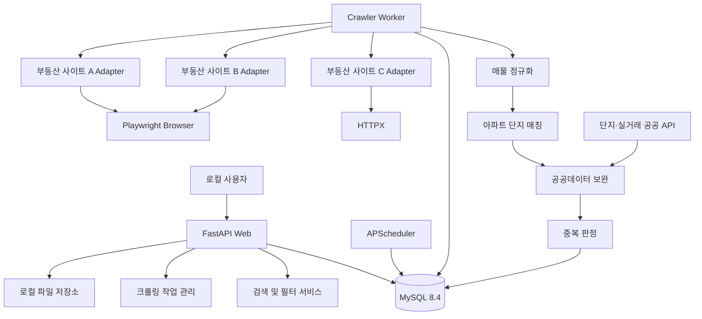
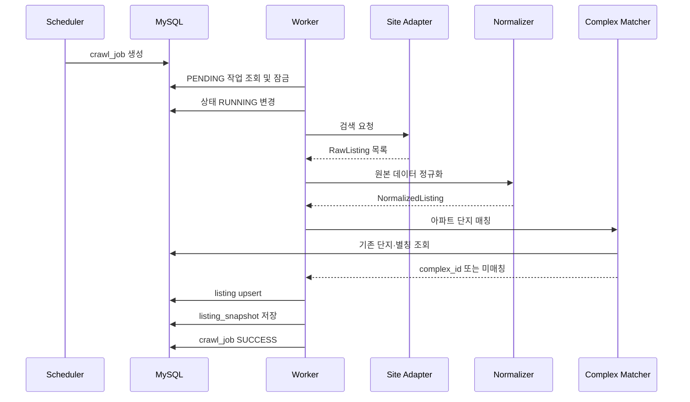
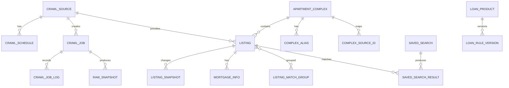

# 개인용 부동산 매물 크롤링·필터링 시스템 아키텍처

> 설계 기준: Python 통합형 + MySQL
> 실행 환경: 개인 PC 로컬 전용
> 주요 기능: 다중 부동산 사이트 크롤링, 매물 통합, 조건 필터링, 가격 이력, 원본 링크 제공

---

# 1. 프로젝트 목표

여러 부동산 사이트에서 아파트 매물을 수집하고 다음 조건을 기준으로 검색한다.

## 필수 검색 조건

* 지역

  * 시·도
  * 시·군·구
  * 읍·면·동
  * 아파트 단지명
* 거래 유형

  * 매매
  * 전세
  * 월세
* 가격

  * 매매가
  * 전세 보증금
  * 월세 보증금
  * 월세
* 아파트 연식

  * 준공 연도
  * 사용승인일
  * 현재 기준 건축 연식
* 세대수
* 전용면적
* 층수
* 융자금

  * 융자 없음으로 명시
  * 융자 있음으로 명시
  * 융자정보 미상
* 정부 대출

  * 매물 조건 기준 적합
  * 사용자 조건 추가 확인 필요
  * 조건 초과
* 출처 사이트
* 등록일과 마지막 확인일

## 부가 기능

* 여러 사이트의 동일 매물 추정
* 사이트별 가격 비교
* 가격 인하 이력
* 신규 매물 표시
* 삭제된 매물 표시
* 관심 매물 저장
* 검색조건 저장
* 원본 매물 링크 제공
* 크롤링 성공·실패 현황 확인
* 로그인 만료 확인
* 수동 크롤링 실행

---

# 2. 아키텍처 핵심 원칙

## 2.1 하나의 Python 프로젝트, 세 개의 실행 프로세스

프로젝트 코드는 하나로 관리하되 실행 프로세스는 분리한다.

```text
1. Web Process
   - 검색 화면
   - 필터링
   - 매물 상세
   - 크롤링 작업 요청
   - 설정 관리

2. Scheduler Process
   - 사이트별 수집 일정 확인
   - 크롤링 작업 생성
   - 오래된 매물 상태 확인 작업 생성

3. Worker Process
   - 실제 브라우저 실행
   - 사이트 크롤링
   - 데이터 파싱
   - 정규화
   - MySQL 저장
```

크롤링을 FastAPI 요청 내부에서 직접 실행하지 않는다.

FastAPI의 백그라운드 작업은 가벼운 후처리에 적합하며, 브라우저 자동화와 같은 오래 걸리는 작업은 별도 작업 프로세스로 분리하는 것이 적합하다.

---

## 2.2 MySQL을 데이터베이스와 간단한 작업 큐로 함께 사용

개인 로컬 시스템이므로 처음부터 Redis, RabbitMQ, Kafka, Celery를 도입하지 않는다.

MySQL에 `crawl_job` 테이블을 두고 다음과 같이 사용한다.

```text
Web 또는 Scheduler
        │
        ▼
crawl_job에 작업 등록
        │
        ▼
Worker가 대기 작업 조회
        │
        ▼
작업 상태를 RUNNING으로 변경
        │
        ▼
크롤링 실행
        │
        ▼
SUCCESS 또는 FAILED 처리
```

워커를 여러 개 실행하게 될 경우에는 `SELECT ... FOR UPDATE SKIP LOCKED` 방식으로 하나의 작업이 중복 실행되는 것을 방지할 수 있다. MySQL 8.4의 잠금 읽기는 `NOWAIT`와 `SKIP LOCKED`를 지원한다.

---

## 2.3 사이트별 크롤링 코드와 공통 비즈니스 로직 분리

각 부동산 사이트의 HTML 구조는 계속 달라질 수 있다.

따라서 다음 코드가 섞이면 안 된다.

```text
사이트 전용 코드
- URL 생성
- 로그인
- 검색조건 입력
- 페이지 이동
- CSS Selector
- 무한 스크롤
- 원본 데이터 추출

공통 코드
- 가격 숫자 변환
- 주소 정규화
- 단지 매칭
- 중복 매물 처리
- 가격 이력
- 융자 상태 판정
- 최종 필터링
```

사이트가 변경되었을 때 해당 사이트의 Adapter만 수정하도록 설계한다.

---

# 3. 전체 시스템 구성도



---

# 4. 추천 기술스택

## 4.1 애플리케이션

| 구분            | 기술           | 역할               |
| ------------- | ------------ | ---------------- |
| 프로그래밍 언어      | Python       | 전체 애플리케이션        |
| API·웹 서버      | FastAPI      | 로컬 웹 서버와 내부 API  |
| HTML 템플릿      | Jinja2       | 서버 렌더링 화면        |
| 화면 상호작용       | HTMX         | 검색·페이징·부분 화면 갱신  |
| 보조 JavaScript | Alpine.js    | 모달·드롭다운·간단한 상태   |
| CSS           | Tailwind CSS | 검색 필터와 리스트 UI    |
| 입력값 검증        | Pydantic     | 요청값 및 크롤링 데이터 검증 |

## 4.2 크롤링

| 구분         | 기술                | 역할                 |
| ---------- | ----------------- | ------------------ |
| 브라우저 자동화   | Playwright Python | JavaScript·로그인 사이트 |
| HTTP 클라이언트 | HTTPX             | 정적 페이지 및 공공 API    |
| HTML 파싱    | selectolax        | 빠른 DOM 파싱          |
| 재시도        | Tenacity          | 네트워크 오류 재시도        |
| 문자열 매칭     | RapidFuzz         | 단지명 유사도 비교         |
| 데이터 처리     | Python 표준 라이브러리   | 숫자·날짜·주소 변환        |

Playwright에서는 로그인 후 쿠키와 로컬 스토리지 상태를 `storage_state`로 저장하고 다시 사용할 수 있다. 해당 파일은 계정을 대신 사용할 수 있는 민감한 쿠키를 포함할 수 있으므로 저장소에 커밋하지 않아야 한다.

## 4.3 데이터베이스

| 구분           | 기술                 |
| ------------ | ------------------ |
| 데이터베이스       | MySQL 8.4 LTS      |
| 저장 엔진        | InnoDB             |
| ORM          | SQLAlchemy 2       |
| DB 드라이버      | PyMySQL            |
| 마이그레이션       | Alembic            |
| 문자셋          | utf8mb4            |
| 기본 Collation | utf8mb4_0900_ai_ci |

MySQL 8.4는 안정적인 기능 집합과 긴 지원 기간을 목적으로 하는 LTS 계열이다. 개인용 장기 운영 도구에는 변경이 잦은 Innovation 계열보다 LTS 계열이 적합하다.

### 비동기 DB를 기본으로 사용하지 않는 이유

이 시스템은 사용자 한 명이 사용하는 로컬 애플리케이션이며, DB 동시 요청보다 크롤링 대기시간이 더 큰 비중을 차지한다.

따라서 초기에는 다음 구성을 추천한다.

```text
FastAPI
+ SQLAlchemy 동기 Session
+ PyMySQL
```

Playwright와 HTTPX 크롤링 부분은 비동기로 실행하되, 데이터베이스 저장은 크롤링 단계가 끝난 뒤 트랜잭션 단위로 처리한다.

추후 동시 사용량이 크게 증가하면 SQLAlchemy의 asyncio 지원과 `asyncmy` MySQL 드라이버로 전환할 수 있다. SQLAlchemy는 asyncio 기반 Core·ORM 사용을 지원하며 MySQL용 asyncmy dialect도 제공한다.

## 4.4 작업 및 실행

| 구분      | 기술                      |
| ------- | ----------------------- |
| 예약 실행   | APScheduler             |
| 프로세스 실행 | Python CLI              |
| 로컬 컨테이너 | Docker Compose          |
| 패키지 관리  | uv                      |
| 테스트     | pytest                  |
| 코드 스타일  | Ruff                    |
| 타입 검사   | mypy 또는 Pyright         |
| 로그      | structlog 또는 표준 logging |

APScheduler는 특정 시간, 미래 시점 또는 반복 주기에 Python 작업을 예약할 수 있다. 일정과 작업을 애플리케이션 재실행 이후에도 유지하려면 영구 저장소를 사용해야 하므로, 이 설계에서는 일정 설정을 MySQL에 저장한다.

---

# 5. 실행 환경

## 5.1 권장 개발 환경

Windows 환경에서는 다음 방식이 가장 편하다.

```text
Windows Host
├─ Python 애플리케이션
├─ Playwright Chromium
├─ 로그인 세션 파일
└─ Docker Desktop
      └─ MySQL 8.4
```

Playwright까지 Docker 안에 넣으면 사용자가 직접 로그인해야 할 때 브라우저 화면 연결이 번거로워질 수 있다.

따라서 초기 개발에서는 다음 구성을 권장한다.

```text
Python + Playwright: 호스트 PC
MySQL: Docker
```

## 5.2 운영 실행 방식

```text
터미널 1: Web
uv run uvicorn realty_radar.web.main:app --host 127.0.0.1 --port 8000

터미널 2: Worker
uv run python -m realty_radar.worker

터미널 3: Scheduler
uv run python -m realty_radar.scheduler
```

최종적으로는 실행 스크립트를 만든다.

```text
start.bat
├─ MySQL 컨테이너 실행
├─ Worker 실행
├─ Scheduler 실행
├─ FastAPI 실행
└─ 브라우저에서 localhost:8000 열기
```

---

# 6. 프로젝트 폴더 구조

```text
realty-radar/
├─ pyproject.toml
├─ uv.lock
├─ alembic.ini
├─ docker-compose.yml
├─ .env
├─ .env.example
├─ .gitignore
├─ README.md
│
├─ src/
│  └─ realty_radar/
│     ├─ __init__.py
│     │
│     ├─ web/
│     │  ├─ main.py
│     │  ├─ dependencies.py
│     │  │
│     │  ├─ routes/
│     │  │  ├─ home.py
│     │  │  ├─ listings.py
│     │  │  ├─ complexes.py
│     │  │  ├─ saved_searches.py
│     │  │  ├─ crawl_jobs.py
│     │  │  └─ settings.py
│     │  │
│     │  ├─ templates/
│     │  │  ├─ base.html
│     │  │  ├─ listings/
│     │  │  ├─ complexes/
│     │  │  ├─ jobs/
│     │  │  └─ settings/
│     │  │
│     │  └─ static/
│     │     ├─ css/
│     │     └─ js/
│     │
│     ├─ domain/
│     │  ├─ listing/
│     │  │  ├─ entities.py
│     │  │  ├─ enums.py
│     │  │  ├─ filters.py
│     │  │  └─ rules.py
│     │  │
│     │  ├─ complex/
│     │  │  ├─ entities.py
│     │  │  └─ matching.py
│     │  │
│     │  ├─ mortgage/
│     │  │  ├─ entities.py
│     │  │  └─ parser.py
│     │  │
│     │  ├─ loan/
│     │  │  ├─ entities.py
│     │  │  └─ evaluator.py
│     │  │
│     │  └─ crawl/
│     │     ├─ entities.py
│     │     └─ states.py
│     │
│     ├─ application/
│     │  ├─ listing_search_service.py
│     │  ├─ crawl_job_service.py
│     │  ├─ crawl_pipeline_service.py
│     │  ├─ listing_upsert_service.py
│     │  ├─ listing_dedup_service.py
│     │  ├─ complex_match_service.py
│     │  ├─ loan_evaluation_service.py
│     │  └─ saved_search_service.py
│     │
│     ├─ crawler/
│     │  ├─ base/
│     │  │  ├─ adapter.py
│     │  │  ├─ models.py
│     │  │  ├─ browser.py
│     │  │  ├─ rate_limiter.py
│     │  │  └─ exceptions.py
│     │  │
│     │  ├─ adapters/
│     │  │  ├─ site_a/
│     │  │  │  ├─ adapter.py
│     │  │  │  ├─ parser.py
│     │  │  │  ├─ selectors.py
│     │  │  │  ├─ normalizer.py
│     │  │  │  └─ fixtures/
│     │  │  │
│     │  │  ├─ site_b/
│     │  │  └─ site_c/
│     │  │
│     │  └─ pipeline/
│     │     ├─ fetch.py
│     │     ├─ parse.py
│     │     ├─ normalize.py
│     │     ├─ enrich.py
│     │     └─ persist.py
│     │
│     ├─ enrichment/
│     │  ├─ public_data/
│     │  │  ├─ apartment_complex_client.py
│     │  │  ├─ sale_transaction_client.py
│     │  │  └─ rent_transaction_client.py
│     │  │
│     │  ├─ address/
│     │  │  ├─ normalizer.py
│     │  │  └─ legal_dong.py
│     │  │
│     │  └─ loan/
│     │     └─ policy_loader.py
│     │
│     ├─ infrastructure/
│     │  ├─ database/
│     │  │  ├─ engine.py
│     │  │  ├─ session.py
│     │  │  ├─ models/
│     │  │  └─ repositories/
│     │  │
│     │  ├─ filesystem/
│     │  │  ├─ auth_state_store.py
│     │  │  └─ snapshot_store.py
│     │  │
│     │  └─ logging/
│     │     └─ config.py
│     │
│     ├─ worker/
│     │  ├─ __main__.py
│     │  ├─ runner.py
│     │  └─ job_handler.py
│     │
│     ├─ scheduler/
│     │  ├─ __main__.py
│     │  ├─ scheduler.py
│     │  └─ schedules.py
│     │
│     ├─ cli/
│     │  ├─ login.py
│     │  ├─ crawl.py
│     │  ├─ reparse.py
│     │  └─ export.py
│     │
│     ├─ config.py
│     └─ constants.py
│
├─ migrations/
│  ├─ env.py
│  └─ versions/
│
├─ tests/
│  ├─ unit/
│  │  ├─ parsers/
│  │  ├─ normalizers/
│  │  ├─ filters/
│  │  └─ loan/
│  │
│  ├─ integration/
│  │  ├─ database/
│  │  └─ repositories/
│  │
│  ├─ crawler/
│  │  └─ fixtures/
│  │
│  └─ e2e/
│
├─ data/
│  ├─ auth/
│  ├─ snapshots/
│  ├─ screenshots/
│  ├─ exports/
│  └─ backups/
│
└─ scripts/
   ├─ start.bat
   ├─ stop.bat
   ├─ backup.bat
   └─ restore.bat
```

---

# 7. 모듈별 책임

## 7.1 `web`

사용자와 직접 상호작용하는 계층이다.

담당 기능:

* 검색조건 입력
* 검색 결과 출력
* 페이징
* 정렬
* 관심 매물
* 매물 상세
* 크롤링 실행 요청
* 작업 상태 조회
* 사이트 설정
* 로그인 필요 상태 표시

`web` 계층에서 Playwright를 직접 호출하지 않는다.

---

## 7.2 `domain`

외부 라이브러리와 데이터베이스에 최대한 의존하지 않는 핵심 규칙 계층이다.

예시:

```text
가격 변환
연식 계산
융자 상태
정부 대출 조건
매물 상태 전환
동일 매물 판단 점수
검색 필터 규칙
```

이 계층은 MySQL이나 Playwright가 없어도 단위 테스트가 가능해야 한다.

---

## 7.3 `application`

여러 Domain과 Repository를 조합하여 실제 사용 사례를 처리한다.

예시:

```text
매물 검색
크롤링 작업 생성
크롤링 결과 저장
단지 매칭
가격 이력 생성
검색조건 실행
정부대출 조건 평가
```

---

## 7.4 `crawler`

사이트별 화면 접근과 원본 데이터 추출을 담당한다.

```text
crawler
├─ 공통 브라우저 관리
├─ 공통 속도 제한
├─ 사이트별 Adapter
├─ 사이트별 Parser
└─ 수집 파이프라인
```

---

## 7.5 `infrastructure`

기술적인 구현을 담당한다.

* MySQL 연결
* SQLAlchemy 모델
* Repository 구현
* 로컬 파일 저장
* HTML 스냅샷 저장
* 로그인 세션 저장
* 로그 설정

---

# 8. 크롤링 Adapter 설계

## 8.1 공통 인터페이스

```python
from typing import Protocol


class ListingSourceAdapter(Protocol):
    source_code: str

    async def validate_session(self) -> bool:
        """현재 로그인 세션 사용 가능 여부 확인."""

    async def search(
        self,
        request: "SourceSearchRequest",
    ) -> list["RawListing"]:
        """검색 결과 페이지에서 매물 목록 수집."""

    async def fetch_detail(
        self,
        raw_listing: "RawListing",
    ) -> "RawListingDetail":
        """개별 매물 상세 정보 수집."""

    async def check_availability(
        self,
        external_listing_id: str,
        source_url: str,
    ) -> bool:
        """기존 매물이 아직 존재하는지 확인."""
```

## 8.2 사이트 Adapter가 반환할 원본 구조

```python
class RawListing:
    source_code: str
    external_listing_id: str | None
    source_url: str

    complex_name_raw: str | None
    address_raw: str | None
    price_raw: str | None
    area_raw: str | None
    floor_raw: str | None
    description_raw: str | None

    collected_at: datetime
    raw_payload: dict
```

사이트 Adapter는 숫자 변환이나 단지 매칭을 최소화한다.

원본 값을 가능한 한 그대로 반환하고, 공통 정규화 단계에서 처리한다.

---

# 9. 크롤링 처리 흐름



## 9.1 상세 처리 단계

```text
1. 작업 생성
2. 로그인 세션 확인
3. 검색페이지 접근
4. 검색조건 입력
5. 매물 카드 수집
6. 필요한 매물만 상세페이지 수집
7. 원본 HTML 또는 JSON 보관
8. 필드 파싱
9. 가격·면적·주소 정규화
10. 단지 매칭
11. 공공 단지정보 보완
12. 중복 판정
13. 매물 upsert
14. 가격 이력 생성
15. 수집되지 않은 기존 매물 상태 갱신
16. 저장 검색조건과 비교
17. 작업 결과 기록
```

---

# 10. MySQL 설계 원칙

## 10.1 데이터 타입

| 데이터    | MySQL 타입          | 설명         |
| ------ | ----------------- | ---------- |
| 내부 ID  | BIGINT UNSIGNED   | 자동 증가      |
| 가격     | BIGINT UNSIGNED   | 원 단위       |
| 면적     | DECIMAL(8,2)      | ㎡ 단위       |
| 비율     | DECIMAL(8,4)      | 유사도·전세가율   |
| 연도     | SMALLINT UNSIGNED | 준공 연도      |
| 세대수    | INT UNSIGNED      | 단지 세대수     |
| 날짜     | DATE              | 계약일·사용승인일  |
| 시각     | DATETIME(6)       | 수집·수정 시간   |
| URL    | VARCHAR(2048)     | 원본 매물 주소   |
| 상태     | VARCHAR(30)       | 상태값        |
| 원본 데이터 | JSON              | 사이트별 추가 필드 |
| 설명     | TEXT              | 매물 설명      |

## 10.2 금액은 실수형을 사용하지 않는다

```text
잘못된 방식:
FLOAT sale_price

권장 방식:
BIGINT UNSIGNED sale_price
```

대한민국 원화 가격은 정수 단위로 저장한다.

```text
6억 5,000만 원
→ 650000000
```

## 10.3 사이트별 원본값은 JSON으로 저장

사이트마다 제공하는 데이터가 다르기 때문에 공통 스키마에 포함되지 않는 값은 JSON에 저장한다.

```json
{
  "raw_price": "매매 6억 5,000",
  "raw_floor": "중/25층",
  "tags": [
    "급매",
    "융자없음"
  ],
  "site_confirmed_date": "2026.07.21"
}
```

단, 검색에 사용하는 값은 반드시 일반 컬럼으로 추출한다.

```text
JSON에만 저장하면 안 되는 값:
- 가격
- 거래유형
- 지역
- 연식
- 세대수
- 면적
- 융자 상태
```

MySQL의 JSON 컬럼은 직접 인덱싱하지 않고, JSON에서 값을 추출한 Generated Column에 인덱스를 생성할 수 있다. 따라서 향후 JSON 내부 값을 자주 검색해야 한다면 Generated Column으로 분리한다.

---

# 11. 핵심 ERD



---

# 12. 핵심 테이블 설계

## 12.1 크롤링 사이트

### `crawl_source`

```sql
CREATE TABLE crawl_source (
    id                  BIGINT UNSIGNED AUTO_INCREMENT PRIMARY KEY,
    code                VARCHAR(50) NOT NULL,
    name                VARCHAR(100) NOT NULL,
    base_url            VARCHAR(500) NOT NULL,

    enabled             BOOLEAN NOT NULL DEFAULT TRUE,
    login_required      BOOLEAN NOT NULL DEFAULT FALSE,
    session_status      VARCHAR(30) NOT NULL DEFAULT 'UNKNOWN',

    minimum_interval_ms INT UNSIGNED NOT NULL DEFAULT 3000,
    maximum_concurrency TINYINT UNSIGNED NOT NULL DEFAULT 1,

    adapter_name        VARCHAR(150) NOT NULL,
    settings_json       JSON NULL,

    last_success_at     DATETIME(6) NULL,
    last_failure_at     DATETIME(6) NULL,

    created_at          DATETIME(6) NOT NULL,
    updated_at          DATETIME(6) NOT NULL,

    UNIQUE KEY uk_crawl_source_code (code)
) ENGINE=InnoDB
  DEFAULT CHARSET=utf8mb4
  COLLATE=utf8mb4_0900_ai_ci;
```

---

## 12.2 크롤링 일정

### `crawl_schedule`

```sql
CREATE TABLE crawl_schedule (
    id                  BIGINT UNSIGNED AUTO_INCREMENT PRIMARY KEY,
    source_id           BIGINT UNSIGNED NOT NULL,
    name                VARCHAR(100) NOT NULL,

    enabled             BOOLEAN NOT NULL DEFAULT TRUE,
    cron_expression     VARCHAR(100) NOT NULL,

    search_condition    JSON NOT NULL,
    next_run_at         DATETIME(6) NULL,
    last_run_at         DATETIME(6) NULL,

    created_at          DATETIME(6) NOT NULL,
    updated_at          DATETIME(6) NOT NULL,

    CONSTRAINT fk_schedule_source
        FOREIGN KEY (source_id)
        REFERENCES crawl_source(id),

    INDEX idx_schedule_next_run (
        enabled,
        next_run_at
    )
) ENGINE=InnoDB
  DEFAULT CHARSET=utf8mb4
  COLLATE=utf8mb4_0900_ai_ci;
```

---

## 12.3 크롤링 작업

### `crawl_job`

```sql
CREATE TABLE crawl_job (
    id                  BIGINT UNSIGNED AUTO_INCREMENT PRIMARY KEY,
    source_id           BIGINT UNSIGNED NOT NULL,
    schedule_id         BIGINT UNSIGNED NULL,

    job_type            VARCHAR(30) NOT NULL,
    status              VARCHAR(30) NOT NULL DEFAULT 'PENDING',
    priority            SMALLINT NOT NULL DEFAULT 100,

    request_json        JSON NOT NULL,
    result_json         JSON NULL,

    attempt_count       SMALLINT UNSIGNED NOT NULL DEFAULT 0,
    maximum_attempts    SMALLINT UNSIGNED NOT NULL DEFAULT 3,

    queued_at           DATETIME(6) NOT NULL,
    started_at          DATETIME(6) NULL,
    completed_at        DATETIME(6) NULL,
    next_retry_at       DATETIME(6) NULL,

    worker_id           VARCHAR(100) NULL,
    error_type          VARCHAR(100) NULL,
    error_message       TEXT NULL,

    CONSTRAINT fk_job_source
        FOREIGN KEY (source_id)
        REFERENCES crawl_source(id),

    CONSTRAINT fk_job_schedule
        FOREIGN KEY (schedule_id)
        REFERENCES crawl_schedule(id),

    INDEX idx_job_polling (
        status,
        next_retry_at,
        priority,
        queued_at
    ),

    INDEX idx_job_source_status (
        source_id,
        status
    )
) ENGINE=InnoDB
  DEFAULT CHARSET=utf8mb4
  COLLATE=utf8mb4_0900_ai_ci;
```

## 작업 상태

```text
PENDING
RUNNING
SUCCESS
FAILED
RETRY_WAIT
AUTH_REQUIRED
BLOCKED
CANCELLED
```

---

## 12.4 아파트 단지

### `apartment_complex`

```sql
CREATE TABLE apartment_complex (
    id                    BIGINT UNSIGNED AUTO_INCREMENT PRIMARY KEY,

    official_name         VARCHAR(255) NOT NULL,
    normalized_name       VARCHAR(255) NOT NULL,

    sido_code             VARCHAR(10) NULL,
    sigungu_code          VARCHAR(10) NULL,
    legal_dong_code       VARCHAR(20) NULL,

    sido_name             VARCHAR(50) NULL,
    sigungu_name          VARCHAR(100) NULL,
    legal_dong_name       VARCHAR(100) NULL,

    road_address          VARCHAR(500) NULL,
    lot_address           VARCHAR(500) NULL,

    approval_date         DATE NULL,
    construction_year     SMALLINT UNSIGNED NULL,
    household_count       INT UNSIGNED NULL,
    building_count        SMALLINT UNSIGNED NULL,
    highest_floor         SMALLINT UNSIGNED NULL,
    parking_count         INT UNSIGNED NULL,

    latitude              DECIMAL(10,7) NULL,
    longitude             DECIMAL(10,7) NULL,
    location              POINT SRID 4326 NULL,

    source_updated_at     DATETIME(6) NULL,
    created_at            DATETIME(6) NOT NULL,
    updated_at            DATETIME(6) NOT NULL,

    INDEX idx_complex_region (
        sido_code,
        sigungu_code,
        legal_dong_code
    ),

    INDEX idx_complex_name (
        normalized_name
    ),

    INDEX idx_complex_build_household (
        construction_year,
        household_count
    )
) ENGINE=InnoDB
  DEFAULT CHARSET=utf8mb4
  COLLATE=utf8mb4_0900_ai_ci;
```

지도 기능을 추가할 가능성이 있다면 `POINT SRID 4326` 컬럼을 유지한다. MySQL은 공간 데이터 타입과 InnoDB의 단일 공간 컬럼에 대한 `SPATIAL INDEX`를 지원한다. 공간 인덱스를 생성할 컬럼은 `NOT NULL`이어야 하므로 초기에는 위도·경도 일반 인덱스를 사용하고, 좌표 데이터가 정비된 후 별도 공간 컬럼을 강제하는 방법이 안전하다.

---

## 12.5 단지 별칭

### `complex_alias`

```sql
CREATE TABLE complex_alias (
    id                  BIGINT UNSIGNED AUTO_INCREMENT PRIMARY KEY,
    complex_id          BIGINT UNSIGNED NOT NULL,

    source_id           BIGINT UNSIGNED NULL,
    alias_name          VARCHAR(255) NOT NULL,
    normalized_alias    VARCHAR(255) NOT NULL,

    match_method        VARCHAR(30) NOT NULL,
    match_confidence    DECIMAL(5,4) NULL,
    manually_verified   BOOLEAN NOT NULL DEFAULT FALSE,

    created_at          DATETIME(6) NOT NULL,

    CONSTRAINT fk_alias_complex
        FOREIGN KEY (complex_id)
        REFERENCES apartment_complex(id),

    CONSTRAINT fk_alias_source
        FOREIGN KEY (source_id)
        REFERENCES crawl_source(id),

    INDEX idx_alias_normalized (
        normalized_alias
    ),

    UNIQUE KEY uk_alias_source_name (
        source_id,
        normalized_alias
    )
) ENGINE=InnoDB
  DEFAULT CHARSET=utf8mb4
  COLLATE=utf8mb4_0900_ai_ci;
```

---

## 12.6 매물

### `listing`

```sql
CREATE TABLE listing (
    id                    BIGINT UNSIGNED AUTO_INCREMENT PRIMARY KEY,

    source_id             BIGINT UNSIGNED NOT NULL,
    external_listing_id   VARCHAR(255) NOT NULL,
    source_url            VARCHAR(2048) NOT NULL,

    complex_id            BIGINT UNSIGNED NULL,
    complex_name_raw      VARCHAR(255) NULL,

    transaction_type      VARCHAR(20) NOT NULL,

    sale_price            BIGINT UNSIGNED NULL,
    deposit               BIGINT UNSIGNED NULL,
    monthly_rent          BIGINT UNSIGNED NULL,

    exclusive_area        DECIMAL(8,2) NULL,
    supply_area           DECIMAL(8,2) NULL,

    floor_number          SMALLINT NULL,
    floor_group           VARCHAR(20) NULL,
    total_floor           SMALLINT UNSIGNED NULL,
    direction             VARCHAR(30) NULL,

    address_raw           VARCHAR(500) NULL,
    description           TEXT NULL,

    mortgage_status       VARCHAR(30) NOT NULL DEFAULT 'UNKNOWN',
    mortgage_amount       BIGINT UNSIGNED NULL,
    mortgage_raw_text     VARCHAR(1000) NULL,
    mortgage_confidence   DECIMAL(5,4) NULL,

    listing_status        VARCHAR(30) NOT NULL DEFAULT 'ACTIVE',

    source_confirmed_at   DATETIME(6) NULL,
    first_seen_at         DATETIME(6) NOT NULL,
    last_seen_at          DATETIME(6) NOT NULL,
    missing_count         SMALLINT UNSIGNED NOT NULL DEFAULT 0,

    raw_data              JSON NULL,

    created_at            DATETIME(6) NOT NULL,
    updated_at            DATETIME(6) NOT NULL,

    CONSTRAINT fk_listing_source
        FOREIGN KEY (source_id)
        REFERENCES crawl_source(id),

    CONSTRAINT fk_listing_complex
        FOREIGN KEY (complex_id)
        REFERENCES apartment_complex(id),

    UNIQUE KEY uk_listing_source_external (
        source_id,
        external_listing_id
    ),

    INDEX idx_listing_search_sale (
        transaction_type,
        listing_status,
        sale_price
    ),

    INDEX idx_listing_search_rent (
        transaction_type,
        listing_status,
        deposit,
        monthly_rent
    ),

    INDEX idx_listing_complex_status (
        complex_id,
        listing_status,
        last_seen_at
    ),

    INDEX idx_listing_mortgage (
        mortgage_status,
        listing_status
    ),

    INDEX idx_listing_recent (
        listing_status,
        first_seen_at
    )
) ENGINE=InnoDB
  DEFAULT CHARSET=utf8mb4
  COLLATE=utf8mb4_0900_ai_ci;
```

---

## 12.7 가격 이력

### `listing_snapshot`

```sql
CREATE TABLE listing_snapshot (
    id                  BIGINT UNSIGNED AUTO_INCREMENT PRIMARY KEY,
    listing_id          BIGINT UNSIGNED NOT NULL,

    sale_price          BIGINT UNSIGNED NULL,
    deposit             BIGINT UNSIGNED NULL,
    monthly_rent        BIGINT UNSIGNED NULL,

    mortgage_status     VARCHAR(30) NOT NULL,
    description_hash    CHAR(64) NULL,

    captured_at         DATETIME(6) NOT NULL,

    CONSTRAINT fk_snapshot_listing
        FOREIGN KEY (listing_id)
        REFERENCES listing(id),

    INDEX idx_snapshot_listing_time (
        listing_id,
        captured_at
    )
) ENGINE=InnoDB
  DEFAULT CHARSET=utf8mb4
  COLLATE=utf8mb4_0900_ai_ci;
```

매번 무조건 스냅샷을 생성하지 않고 다음 값 중 하나가 변경되었을 때만 생성한다.

```text
- 매매가
- 전세보증금
- 월세보증금
- 월세
- 융자 상태
- 매물 설명
- 매물 확인일
```

---

# 13. 융자금 데이터 설계

융자 정보는 반드시 3단계 상태로 관리한다.

```text
EXPLICIT_NONE
매물 설명에 융자 없음이 명시됨

EXPLICIT_EXISTS
융자·근저당·채권최고액이 있다고 명시됨

UNKNOWN
관련 정보가 없거나 해석 불가
```

## 잘못된 처리

```text
매물 설명에 융자 내용 없음
→ 융자 없음
```

## 올바른 처리

```text
매물 설명에 융자 내용 없음
→ UNKNOWN
```

## 키워드 분석 예시

```text
"융자 없음"
"융자무"
"근저당 없음"
→ EXPLICIT_NONE

"융자 30%"
"근저당 있음"
"채권최고액 2억"
→ EXPLICIT_EXISTS

"융자 협의"
"대출 확인 필요"
→ UNKNOWN 또는 EXPLICIT_EXISTS + 낮은 신뢰도
```

## 검색 필터

```text
융자 상태:
[ ] 융자 없음 명시
[ ] 융자 있음
[ ] 정보 미상
[ ] 정보 미상 제외
```

화면에서는 다음 안내를 표시한다.

```text
융자 정보는 해당 사이트의 매물 설명을 기반으로 분류했습니다.
실제 권리관계는 등기사항증명서로 별도 확인해야 합니다.
```

---

# 14. 단지 매칭 설계

크롤링한 매물에는 공식 단지 ID가 없는 경우가 많다.

따라서 여러 기준을 점수화한다.

## 14.1 매칭 우선순위

```text
1. 사이트 내부 단지 ID와 기존 매핑
2. 법정동 코드 + 지번
3. 도로명주소
4. 정규화 단지명 + 지역
5. 단지명 유사도 + 준공연도
6. 단지명 유사도 + 세대수
7. 좌표 거리
```

## 14.2 점수 예시

```text
주소 완전 일치             +50
법정동 일치                +15
정규화 단지명 완전 일치    +25
단지명 유사도 90% 이상     +20
준공연도 일치              +5
세대수 일치                +5
좌표 100m 이내             +10
```

## 14.3 판정 기준

```text
90점 이상    자동 연결
75~89점      자동 연결 후 검토 표시
50~74점      사용자 확인 필요
50점 미만    미매칭
```

사용자가 수동으로 연결한 결과는 `complex_alias`에 저장해 다음 수집부터 자동 적용한다.

---

# 15. 동일 매물 추정

## 15.1 같은 사이트

같은 사이트에서는 다음 키로 확정한다.

```text
source_id + external_listing_id
```

## 15.2 서로 다른 사이트

사이트 간에는 다음 항목을 조합한다.

```text
complex_id
+ transaction_type
+ exclusive_area
+ floor_group
+ 가격
+ 방향
+ 설명 유사도
```

## 중복 점수 예시

```text
단지 일치          40점
거래유형 일치      10점
면적 오차 0.5㎡    15점
가격 일치          15점
층 그룹 일치       10점
방향 일치           5점
설명 유사           5점
```

```text
85점 이상: 동일 매물 가능성 높음
70~84점: 동일 매물 추정
70점 미만: 별도 매물
```

동·호수 정보가 없으면 확정 중복으로 처리하지 않는다.

---

# 16. 필터링 아키텍처

필터링은 사이트가 아니라 MySQL에서 최종적으로 수행한다.

## 16.1 검색 요청 모델

```python
class ListingSearchFilter:
    region_codes: list[str]
    complex_keyword: str | None

    transaction_types: list[str]

    minimum_sale_price: int | None
    maximum_sale_price: int | None

    minimum_deposit: int | None
    maximum_deposit: int | None
    maximum_monthly_rent: int | None

    minimum_construction_year: int | None
    maximum_building_age: int | None

    minimum_households: int | None
    maximum_households: int | None

    minimum_exclusive_area: float | None
    maximum_exclusive_area: float | None

    mortgage_statuses: list[str]
    source_ids: list[int]

    loan_product_ids: list[int]

    sort: str
    page: int
    page_size: int
```

## 16.2 SQL 조회 구조

```sql
SELECT
    l.id,
    l.transaction_type,
    l.sale_price,
    l.deposit,
    l.monthly_rent,
    l.exclusive_area,
    l.floor_group,
    l.mortgage_status,
    l.source_url,
    l.first_seen_at,
    l.last_seen_at,

    c.official_name,
    c.sido_name,
    c.sigungu_name,
    c.legal_dong_name,
    c.construction_year,
    c.household_count,

    s.name AS source_name
FROM listing l
JOIN crawl_source s
  ON s.id = l.source_id
LEFT JOIN apartment_complex c
  ON c.id = l.complex_id
WHERE l.listing_status = 'ACTIVE'
  AND (:transaction_type IS NULL
       OR l.transaction_type = :transaction_type)
  AND (:minimum_price IS NULL
       OR l.sale_price >= :minimum_price)
  AND (:maximum_price IS NULL
       OR l.sale_price <= :maximum_price)
  AND (:minimum_year IS NULL
       OR c.construction_year >= :minimum_year)
  AND (:minimum_households IS NULL
       OR c.household_count >= :minimum_households)
ORDER BY l.first_seen_at DESC
LIMIT :page_size OFFSET :offset;
```

## 16.3 검색 인덱스 전략

모든 필터 조합별로 인덱스를 만들지 않는다.

우선 다음 인덱스를 운영한다.

```text
거래유형 + 상태 + 가격
단지 ID + 상태
지역 코드
준공연도 + 세대수
융자 상태 + 매물 상태
출처 + 외부 매물 ID
매물 상태 + 최초 발견일
```

MySQL의 복합 인덱스는 왼쪽부터 이어지는 컬럼 조합을 활용하므로 자주 사용되는 필터 순서를 기준으로 컬럼 순서를 결정해야 한다. 불필요하게 많은 인덱스는 저장공간과 쓰기 비용을 증가시키므로 실제 쿼리의 `EXPLAIN` 결과를 보고 추가한다.

---

# 17. 정부 대출 필터 구조

정부 대출 가능 여부는 두 단계로 나눈다.

## 17.1 매물 기준 판정

매물만 보고 계산할 수 있는 값:

* 거래가격
* 주택 유형
* 전용면적
* 주택 소재지
* 단지 정보
* 공시가격 참고값

## 17.2 사용자 기준 판정

사용자가 로컬 설정으로 입력해야 하는 값:

* 무주택 여부
* 부부합산 소득
* 순자산
* 세대주 여부
* 혼인 여부
* 자녀 수
* 생애최초 여부
* 기존 대출

## 판정 결과

```text
ELIGIBLE
현재 입력된 조건 기준 충족

PROPERTY_ELIGIBLE
매물 조건은 충족하지만 개인 조건 확인 필요

CONDITIONAL
일부 정보 부족

INELIGIBLE
명확한 조건 초과

UNKNOWN
규칙 또는 데이터 부족
```

## 규칙 저장 구조

### `loan_rule_version`

```text
id
loan_product_id
effective_from
effective_to
property_rule_json
applicant_rule_json
source_reference
created_at
```

대출 규칙은 소스코드에 직접 고정하지 않고 시행일 기준으로 버전 관리한다.

---

# 18. 작업 큐 처리

## Worker 작업 조회 예시

```sql
START TRANSACTION;

SELECT id
FROM crawl_job
WHERE status IN ('PENDING', 'RETRY_WAIT')
  AND (
      next_retry_at IS NULL
      OR next_retry_at <= NOW(6)
  )
ORDER BY priority ASC, queued_at ASC
LIMIT 1
FOR UPDATE SKIP LOCKED;

UPDATE crawl_job
SET
    status = 'RUNNING',
    worker_id = :worker_id,
    started_at = NOW(6),
    attempt_count = attempt_count + 1
WHERE id = :job_id;

COMMIT;
```

## 재시도 정책

```text
네트워크 연결 실패
→ 최대 3회 재시도

페이지 로딩 시간 초과
→ 최대 2회 재시도

사이트 HTML 변경
→ 재시도하지 않고 FAILED

로그인 만료
→ AUTH_REQUIRED

403 또는 429
→ BLOCKED 처리 후 해당 사이트 작업 중단

CAPTCHA
→ BLOCKED 처리 후 사용자 확인
```

## 지수 백오프

```text
1회 실패: 5분 후
2회 실패: 30분 후
3회 실패: 2시간 후
```

---

# 19. 원본 데이터 및 실패 자료 보관

MySQL에 모든 HTML을 넣지 않는다.

대형 HTML·스크린샷은 로컬 파일로 보관하고 MySQL에는 경로와 해시만 저장한다.

```text
data/
├─ snapshots/
│  └─ site-a/
│     └─ 2026-07-21/
│        ├─ search-001.html.gz
│        └─ detail-12345.html.gz
│
├─ screenshots/
│  └─ site-a/
│     └─ job-728-error.png
│
└─ auth/
   ├─ site-a.json
   └─ site-b.json
```

## `raw_snapshot`

```text
id
crawl_job_id
source_id
snapshot_type
source_url
file_path
content_hash
http_status
captured_at
expires_at
```

## 보관 정책

```text
성공한 일반 검색 HTML: 7일
가격 변경이 발생한 상세 HTML: 30일
실패 HTML·스크린샷: 수동 삭제 전까지
로그인 세션: 만료 또는 재로그인 시 교체
```

---

# 20. 매물 상태 변경

## 상태값

```text
ACTIVE
현재 사이트에서 확인됨

STALE
최근 수집에서 발견되지 않음

REMOVED
여러 번 연속 발견되지 않음

SOLD_OR_CONTRACTED
사이트에서 계약 또는 거래완료 표시

UNKNOWN
페이지 확인 실패
```

## 상태 변경 규칙

```text
새 매물 발견
→ ACTIVE
→ first_seen_at 저장

다음 수집에서도 발견
→ ACTIVE 유지
→ last_seen_at 갱신
→ missing_count = 0

1회 미발견
→ STALE
→ missing_count = 1

3회 연속 미발견
→ REMOVED

사이트에서 거래완료 확인
→ SOLD_OR_CONTRACTED
```

크롤링 자체가 실패한 경우에는 매물을 `STALE`이나 `REMOVED`로 변경하면 안 된다.

---

# 21. Web 화면 구성

## 21.1 통합 검색

```text
┌──────────────────────────────────────────────────────────────┐
│ 지역        [서울특별시] [영등포구] [여의도동]               │
│ 거래유형    [매매] [전세] [월세]                             │
│ 가격        [4억] ~ [8억]                                    │
│ 준공연도    [2000년] 이후                                    │
│ 세대수      [500] 이상                                       │
│ 면적        [59㎡] ~ [85㎡]                                  │
│ 융자        [융자 없음 명시] [미상 제외]                     │
│ 출처        [사이트 A] [사이트 B]                            │
│                                            [검색] [조건 저장] │
├──────────────────────────────────────────────────────────────┤
│ 전체 42건 · 신규 5건 · 가격 인하 3건                         │
├──────────────────────────────────────────────────────────────┤
│ OO아파트 · 매매 6억 2,000만 · 84㎡ · 중층                    │
│ 2012년 · 1,250세대 · 융자 없음 명시                          │
│ 최근 실거래 6억 · 최초 발견가 6억 5,000만                    │
│ 사이트 A · 20분 전 확인                         [원본 보기]   │
└──────────────────────────────────────────────────────────────┘
```

## 21.2 크롤링 관리

* 사이트별 활성화 상태
* 로그인 상태
* 마지막 성공시간
* 마지막 실패시간
* 신규 매물 수
* 변경 매물 수
* 실패 메시지
* 다음 실행시간
* 수동 실행
* 로그인 다시 하기
* 실패 화면 열기

## 21.3 단지 상세

* 단지 기본정보
* 연식
* 세대수
* 사이트별 매물
* 가격순 정렬
* 최근 실거래가
* 면적별 가격
* 매물 가격 이력
* 융자 관련 원문
* 정책대출 예상 판정

---

# 22. 내부 API 설계

## 매물 검색

```http
GET /api/listings
```

```text
regionCode
transactionType
minPrice
maxPrice
minConstructionYear
minHouseholds
minArea
maxArea
mortgageStatus
sourceIds
sort
page
pageSize
```

## 매물 상세

```http
GET /api/listings/{listingId}
```

## 단지 상세

```http
GET /api/complexes/{complexId}
```

## 크롤링 작업 생성

```http
POST /api/crawl-jobs
```

```json
{
  "sourceId": 1,
  "jobType": "SEARCH",
  "condition": {
    "regions": [
      "서울특별시 영등포구"
    ],
    "transactionTypes": [
      "SALE"
    ]
  }
}
```

## 크롤링 작업 조회

```http
GET /api/crawl-jobs
GET /api/crawl-jobs/{jobId}
```

## 저장 검색조건 실행

```http
POST /api/saved-searches/{savedSearchId}/run
```

---

# 23. 설정 파일

## `.env`

```text
APP_ENV=local
APP_HOST=127.0.0.1
APP_PORT=8000

MYSQL_HOST=127.0.0.1
MYSQL_PORT=3306
MYSQL_DATABASE=realty_radar
MYSQL_USER=realty_app
MYSQL_PASSWORD=change-me

DATA_DIRECTORY=./data
AUTH_DIRECTORY=./data/auth
SNAPSHOT_DIRECTORY=./data/snapshots
SCREENSHOT_DIRECTORY=./data/screenshots

LOG_LEVEL=INFO
```

## 사이트별 비민감 설정

```yaml
sources:
  site_a:
    enabled: true
    request_interval_ms: 4000
    maximum_concurrency: 1
    login_required: true

  site_b:
    enabled: false
    request_interval_ms: 5000
    maximum_concurrency: 1
    login_required: false
```

비밀번호와 로그인 쿠키는 YAML에 넣지 않는다.

---

# 24. Docker Compose

```yaml
services:
  mysql:
    image: mysql:8.4
    container_name: realty-radar-mysql
    restart: unless-stopped

    environment:
      MYSQL_DATABASE: realty_radar
      MYSQL_USER: realty_app
      MYSQL_PASSWORD: change-me
      MYSQL_ROOT_PASSWORD: root-change-me
      TZ: Asia/Seoul

    ports:
      - "127.0.0.1:3306:3306"

    volumes:
      - mysql_data:/var/lib/mysql

    command:
      - --character-set-server=utf8mb4
      - --collation-server=utf8mb4_0900_ai_ci

    healthcheck:
      test:
        - CMD
        - mysqladmin
        - ping
        - -h
        - localhost
      interval: 10s
      timeout: 5s
      retries: 10

volumes:
  mysql_data:
```

포트는 `127.0.0.1`에만 바인딩해 외부 네트워크에서 접근되지 않도록 한다.

---

# 25. 로깅 및 모니터링

개인용이더라도 크롤러는 실패 원인을 찾기 어려우므로 구조화 로그가 필요하다.

## 필수 로그 필드

```text
timestamp
level
source_code
crawl_job_id
external_listing_id
stage
duration_ms
error_type
message
```

## 크롤링 단계

```text
SESSION_CHECK
SEARCH_PAGE
SCROLL
LIST_PARSE
DETAIL_FETCH
DETAIL_PARSE
NORMALIZE
COMPLEX_MATCH
PERSIST
STATUS_RECONCILE
```

## 수집 관리 화면 지표

```text
사이트 A
- 마지막 성공: 2026-07-21 21:30
- 소요시간: 4분 12초
- 조회 페이지: 18개
- 발견 매물: 142개
- 신규 매물: 7개
- 가격 변경: 3개
- 파싱 실패: 1개
```

---

# 26. 테스트 전략

## 26.1 Parser 단위 테스트

실제 사이트에 매번 접속하지 않고 저장된 HTML Fixture를 사용한다.

```text
tests/crawler/fixtures/site_a/
├─ search-normal.html
├─ search-empty.html
├─ detail-normal.html
├─ detail-mortgage-none.html
├─ detail-mortgage-exists.html
└─ login-expired.html
```

검증 항목:

* 매물 ID
* 가격
* 면적
* 층
* 단지명
* 융자 문구
* 원본 링크

## 26.2 정규화 테스트

```text
"6억 5,000"
→ 650000000

"전세 3억"
→ deposit = 300000000

"84.97㎡"
→ 84.97

"중/25층"
→ floor_group = MIDDLE
→ total_floor = 25
```

## 26.3 Repository 통합 테스트

SQLite를 테스트 대체재로 사용하지 않는다.

MySQL과 SQLite는 타입, JSON, 인덱스, SQL 동작 차이가 있으므로 테스트용 MySQL 컨테이너를 사용한다.

## 26.4 실사이트 Smoke Test

실제 사이트 접근 테스트는 최소화한다.

```text
- 로그인 여부 확인
- 검색 페이지 접근
- 첫 번째 매물 카드 파싱
- 상세 페이지 한 건 파싱
```

전체 크롤링을 CI 테스트처럼 반복 실행하지 않는다.

---

# 27. 보안 설계

## 필수 설정

* FastAPI를 `127.0.0.1`에만 바인딩
* MySQL을 `127.0.0.1`에만 바인딩
* `.env` Git 제외
* `data/auth` Git 제외
* Playwright 세션 파일 Git 제외
* 크롤링한 전화번호 저장 최소화
* 주민등록번호 등 개인정보 저장 금지
* 원본 HTML 보관 기간 제한
* DB 계정에 필요한 권한만 부여
* MySQL root 계정을 애플리케이션에서 사용하지 않음

## `.gitignore`

```text
.env
data/auth/
data/snapshots/
data/screenshots/
data/exports/
data/backups/

__pycache__/
.pytest_cache/
.mypy_cache/
.ruff_cache/
.venv/
```

---

# 28. 크롤링 안전 경계

로컬 개인용이라도 다음 기능은 구현하지 않는다.

* CAPTCHA 자동 우회
* 접근 제한 우회
* IP 순환 프록시
* 브라우저 지문 위장
* 비공개 인증키 탈취
* 과도한 병렬 요청
* 로그인하지 않고 접근할 수 없는 정보의 강제 호출
* 다른 이용자의 개인정보 수집
* 서비스의 전체 데이터베이스를 대량 복제하는 방식

사이트가 `403`, `429`, CAPTCHA 또는 추가 인증을 반환하면 해당 수집을 중단하고 관리 화면에서 사용자 확인이 필요하다고 표시한다.

---

# 29. 구현 순서

## 1단계: 프로젝트 기반

* Python 프로젝트 생성
* FastAPI 실행
* MySQL Docker 구성
* SQLAlchemy 연결
* Alembic 마이그레이션
* 기본 검색 화면

## 2단계: 첫 번째 사이트 Adapter

* 수동 로그인 스크립트
* 검색 페이지 접근
* 매물 목록 수집
* 매물 상세 수집
* 원본 HTML 저장
* 매물 MySQL 저장

## 3단계: 필터링

* 지역
* 거래유형
* 가격
* 면적
* 출처
* 신규 매물
* 정렬
* 페이징

## 4단계: 단지정보 결합

* 단지 테이블
* 단지명 정규화
* 단지 매칭
* 준공 연도
* 세대수
* 주소

## 5단계: 고급 필터

* 연식
* 세대수
* 융자 상태
* 최근 확인일
* 가격 인하
* 최근 실거래 대비 가격

## 6단계: 예약 실행

* `crawl_job`
* Worker
* Scheduler
* 재시도
* 로그인 만료
* 실패 스크린샷

## 7단계: 다중 사이트

* 두 번째 Adapter
* 세 번째 Adapter
* 사이트 간 중복 추정
* 사이트별 가격 비교

## 8단계: 대출 규칙

* 대출상품 테이블
* 규칙 버전
* 사용자 조건 설정
* 매물별 예상 판정

---

# 30. 최종 권장 구조

```text
Python Application
│
├─ FastAPI + Jinja2 + HTMX
│  ├─ 매물 검색
│  ├─ 매물 상세
│  ├─ 저장 검색조건
│  └─ 수집 관리
│
├─ Crawler Worker
│  ├─ Playwright
│  ├─ HTTPX
│  ├─ Site Adapter
│  ├─ Parser
│  ├─ Normalizer
│  ├─ Complex Matcher
│  └─ Listing Upsert
│
├─ APScheduler
│  └─ MySQL에 Crawl Job 등록
│
├─ MySQL 8.4 LTS
│  ├─ 단지
│  ├─ 매물
│  ├─ 가격 이력
│  ├─ 융자 상태
│  ├─ 작업 큐
│  ├─ 저장 검색조건
│  └─ 대출 규칙
│
└─ Local File Storage
   ├─ 로그인 상태
   ├─ HTML 스냅샷
   ├─ 실패 스크린샷
   ├─ 내보내기
   └─ 백업
```

## 초기에 사용하지 않을 기술

```text
React
Next.js
Redis
Celery
Kafka
RabbitMQ
OpenSearch
Elasticsearch
Kubernetes
AWS
회원가입
외부 배포
모바일 앱
```

## 최종 기술 조합

```text
Python
FastAPI
Jinja2
HTMX
Tailwind CSS
Playwright
HTTPX
selectolax
SQLAlchemy
PyMySQL
Alembic
MySQL 8.4 LTS
APScheduler
pytest
Docker Compose
```

이 프로젝트에서는 복잡한 프론트엔드보다 다음 세 가지가 더 중요하다.

1. 사이트별 크롤러를 독립적인 Adapter로 분리하는 것
2. 원본 매물과 정규화 데이터를 구분해서 저장하는 것
3. 필터링 가능한 값들을 MySQL 일반 컬럼과 인덱스로 관리하는 것

첫 번째 개발 목표는 **사이트 한 곳, 지역 한 곳, 거래유형 한 가지를 안정적으로 수집하고 MySQL에서 필터링하는 것**으로 제한하는 것이 좋다.
