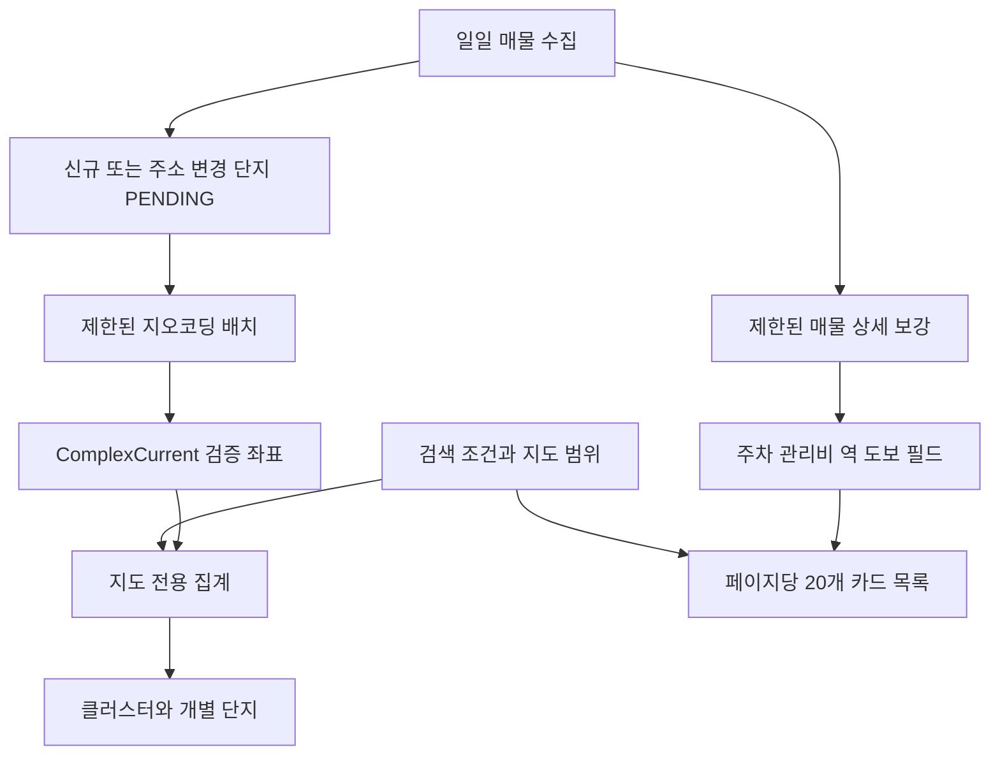

# 지도 데이터 선수집 및 전체 단지 표시 설계

## 배경

현재 지도는 검색 결과 한 페이지에서 최대 20개 단지만 받아 기본 NAVER 마커로 표시한다. 따라서 좌표가 모두 준비되어도 전체 검색 결과가 지도에 나타나지 않으며, 넓은 범위에서는 가까운 마커가 겹쳐 일부만 보이는 것처럼 보인다. 지도 요청 중에 검색 페이지의 단지 주소를 즉시 지오코딩하는 구조도 응답 시간을 외부 API 상태에 종속시킨다.

2026-08-03 운영 DB 확인 결과는 다음과 같다.

- 단지: 14,306개
- 지오코딩 성공: 147개
- 지오코딩 대기: 14,159개
- 대기 중 고유 주소: 14,108개
- 활성 매물: 683,947개
- 활성 매물 상세 필드 커버리지: 주차 1.6%, 관리비 0.6%, 역 도보 1.1%

사용자가 제공한 월 한도는 Geocoding 3,000,000회다. 현재 고유 대기 주소를 한 번씩 처리하면 약 0.47%를 사용한다. Dynamic Map은 브라우저 지도 렌더링 호출이며 사전 데이터 수집 수단이 아니다. Directions 5와 Directions 15는 자동차 경로만 제공하므로 이번 설계의 대중교통 통근 정보에는 사용하지 않는다.

## 목표

1. 기존 단지 좌표를 화면 요청 전에 안전하게 수집하고 신규·주소 변경 단지만 계속 보강한다.
2. 지도 집계를 목록의 20개 페이지네이션과 분리해 현재 검색 조건과 지도 범위에 맞는 모든 단지를 표현한다.
3. 넓은 범위에서는 모든 단지를 클러스터 합계로, 확대된 범위에서는 개별 단지로 표시한다.
4. 주차·관리비·역 도보 등 기존 상세 수집 필드를 제한된 속도로 미리 보강한다.
5. 미수집·API 실패·원본 미제공 값을 추정하지 않고 사용자에게 상태를 명확히 보여준다.

## 비목표

- Directions API를 대중교통 출퇴근 시간으로 사용하지 않는다.
- Reverse Geocoding과 Static Map을 호출하지 않는다.
- 지도 축소 상태에서 수만 개의 개별 마커 객체를 브라우저에 생성하지 않는다.
- 리뷰·소음·주차 체감처럼 현재 신뢰할 원본이 없는 값을 생성하지 않는다.
- 이번 작업과 관계없는 검색 필터나 즐겨찾기 구조를 리팩터링하지 않는다.

## 핵심 사용자 동작

1. 검색 화면을 열면 지도에는 현재 조건과 일치하는 전체 단지가 클러스터 또는 개별 마커로 표현된다.
2. 클러스터에는 포함 단지 수가 표시되며, 선택하면 해당 클러스터 범위로 확대된다.
3. 충분히 확대된 지도에서 이동이 끝나면 하단 목록이 현재 지도 범위의 매물 20개로 갱신된다.
4. 목록 페이지네이션은 카드에만 적용된다. 지도 마커 수를 20개로 제한하지 않는다.
5. 상단 상태는 `검색 일치 단지 N · 지도 표현 N · 좌표 확인 대기 N` 형식으로 좌표 누락을 구분한다.

## 아키텍처

### 1. 좌표 선수집

기존 `ComplexCurrent`의 좌표와 지오코딩 상태 필드를 그대로 사용하며 새 좌표 테이블을 만들지 않는다. `ComplexGeocodeBackfill`은 다음 규칙을 따른다.

- 후보는 `PENDING` 또는 재시도 시간이 지난 `FAILED` 단지다.
- 동일 주소가 이미 `OK`인 다른 단지에 있으면 외부 호출 없이 좌표를 복사한다.
- 같은 실행 안의 동일 주소는 한 번만 호출하고 결과를 공유한다.
- 주소 변경 시 기존 좌표를 지우고 `PENDING`으로 되돌리는 현재 저장 규칙을 유지한다.
- `NOT_FOUND`는 주소가 바뀌기 전까지 반복 호출하지 않는다.
- 일시 실패는 현재 6시간 재시도 규칙을 유지한다.

초기 보강은 명시적 CLI로 실행한다. 한 트랜잭션에서 전체 주소를 처리하지 않고 100개 단위로 커밋하며, 실행 전체 요청 상한을 15,000회로 제한한다. 중단되면 커밋된 지점 이후의 `PENDING`부터 재개한다. 초기 보강 후에는 별도 일일 스케줄이 최대 500개의 신규·변경·재시도 후보만 처리한다.

웹의 `/listings/map` 요청에서는 지오코딩과 DB 커밋을 제거한다. 화면 요청은 이미 저장된 좌표만 읽으며 외부 API 장애가 검색 응답 시간을 늘리지 않게 한다.

### 2. 목록과 분리된 지도 집계

지도 데이터 요청은 카드 목록 결과를 재사용하지 않는다. 지도 전용 조회 서비스가 동일한 영속 검색 조건을 적용한 뒤 단지별로 다음 정보를 집계한다.

- 단지 ID와 이름
- 검증된 위도·경도
- 일치 매물 수
- 최저·최고 가격
- 좌표 확인 대기 단지 수

지도 조회는 현재 목록 커서와 페이지 크기를 무시한다. `ListingSearchService`의 기존 SQL 필터 계약을 공용의 작은 predicate builder로 추출해 카드 검색과 지도 집계가 가격·거래유형·지역·단기임대 제외 조건에서 어긋나지 않게 한다. 대출 가능 여부처럼 최종 Python 판정이 필요한 필터도 기존 판정 규칙을 재사용하며, 이를 생략한 근사 개수를 표시하지 않는다.

지도 응답 형식은 두 종류다.

- `cluster`: 중심 좌표, 포함 단지 수, 클러스터 경계, 일치 매물 수, 가격 범위
- `marker`: 단지 ID, 이름, 좌표, 일치 매물 수, 가격 범위

서버는 지도 범위와 확대 단계에 맞는 격자로 검증된 좌표 전체를 묶는다. 한 격자에 단지가 하나면 `marker`, 둘 이상이면 `cluster`를 반환한다. 이 방식으로 응답 크기를 제한하면서도 조회된 단지를 조용히 버리지 않는다. 클러스터에 포함된 단지 수의 합과 개별 마커 수의 합은 `지도 표현 단지 수`와 항상 같아야 한다.

초기 지도는 검색 조건의 전체 범위를 클러스터로 요청한다. 사용자가 지도와 상호작용한 뒤에는 현재 경계를 함께 보내 해당 범위만 다시 집계한다. 넓은 범위에서 목록 검색을 막는 기존 확대 단계 가드는 유지하지만, 지도 클러스터 자체는 넓은 범위에서도 표시한다.

### 3. 지도 UI

기본 NAVER 핀만 나열하는 방식을 클러스터와 가격 마커가 구분되는 오버레이로 교체한다.

- 클러스터: `12개 단지`처럼 개수를 우선 표시한다.
- 개별 단지: 최저 가격과 매물 수를 짧게 표시한다.
- 클러스터 선택: 저장된 클러스터 경계로 `fitBounds`한다.
- 개별 단지 선택: 기존 정보창에 단지명·주소·가격 범위·매물 수를 표시한다.
- 지도 이동: 300ms 디바운스와 오래된 응답 폐기 규칙을 유지한다.
- 지도 범위 목록 요청: 충분히 확대된 경우에만 하단 카드 20개를 갱신한다.

지도 상태 문구는 다음을 구분한다.

- 정상: 검색 일치·지도 표현·좌표 대기 단지 수
- 보강 진행 중: 좌표가 없어 표현하지 못한 단지 수
- 지도 SDK 실패: 기존 목록을 유지하고 재시도 안내
- 지도 집계 실패: 기존 마커와 목록을 유지하고 오류 안내

### 4. 매물 상세 선수집

주차·관리비·역 도보는 NAVER Maps 한도와 무관하며 기존 매물 상세 수집 경로가 원본이다. 기존 `MortgageEnrichmentRunner`의 파싱과 DB 필드를 재사용한다.

- 활성 상태이고 `detail_checked_at IS NULL`인 매물만 후보로 삼는다.
- 현재 크롤 작업의 신규·변경 매물을 우선 처리하고 오래된 미확인 매물을 이어서 처리한다.
- 동시성은 기존 기본값 2를 유지한다.
- 기존 크롤 작업당 100개 보강은 유지한다.
- 별도 일일 따라잡기 작업은 최대 5,000개까지만 처리하고 실행 중복을 금지한다.
- 응답 실패 행은 확인 완료로 표시하지 않아 다음 실행에서 다시 후보가 될 수 있게 한다.
- 상세를 아직 조회하지 않은 `detail_checked_at IS NULL` 행은 `확인 대기`로 표시한다.
- 상세 조회는 성공했지만 원본에 특정 값이 없으면 필드는 `NULL`로 두고 `원본 미제공`으로 표시한다.

상세 선수집은 68만여 활성 매물을 한 번에 호출하지 않는다. 운영 화면에는 전체·확인 완료·필드별 값 보유 비율을 기록해 실제 진행 속도와 원본 제공 한계를 구분한다.

## 데이터 흐름

## 오류 및 안전 처리

- 지오코딩 API가 구성되지 않았으면 배치는 DB를 변경하지 않고 명확히 실패한다.
- HTTP 오류나 잘못된 응답은 `FAILED`와 재시도 시각으로 기록하며 좌표를 임의 생성하지 않는다.
- 각 지오코딩 배치 커밋이 성공한 뒤에만 다음 배치로 진행한다.
- 지도 데이터 요청은 읽기 전용이며 외부 API를 호출하지 않는다.
- 지도 집계의 응답 순서가 뒤바뀌어도 마지막 요청만 화면에 반영한다.
- 상세 보강 작업은 한 프로세스에서 하나만 실행되며 제한된 동시성과 일일 상한을 지킨다.
- 검색 조건과 지도 집계가 일치하지 않는 경우 근사 결과를 표시하지 않고 오류로 처리한다.

## 성능 기준

- 전국 단위 초기 지도 응답은 개별 단지 14,000여 개가 아니라 클러스터 응답이어야 한다.
- 지도 전용 SQL은 실제 MySQL에서 `EXPLAIN ANALYZE`로 검증한다.
- 대표 검색 조건의 지도 데이터 응답 목표는 서버 처리 p95 1초 이하다.
- 좌표 인덱스나 새 집계 테이블은 실제 실행 계획이 목표 미달을 증명할 때만 추가한다.
- 지도 데이터 JSON은 대표 전국 검색에서 1MB 이하를 목표로 한다.

## 테스트 및 검증

### 단위 테스트

- 동일 주소 여러 단지는 외부 지오코딩을 한 번만 호출한다.
- 기존 성공 주소를 재사용하면 외부 호출을 하지 않는다.
- 배치 실패·재시도·`NOT_FOUND` 상태 전이가 정확하다.
- 클러스터 회원 수와 개별 마커 수의 합이 전체 지도 표현 수와 일치한다.
- 지도 확대 단계별 격자 크기가 예상 방향으로 줄어든다.

### 통합 테스트

- 지도 요청은 geocoder를 호출하거나 DB를 커밋하지 않는다.
- 목록 첫 페이지가 20개여도 지도 집계는 전체 일치 단지를 표현한다.
- 카드 검색과 지도 집계가 동일 필터에서 같은 단지 집합을 사용한다.
- 좌표 없는 단지는 마커에서 제외되지만 `좌표 확인 대기` 수에는 포함된다.
- 지도 경계 밖 단지는 현재 범위 응답에서 제외된다.
- 상세 보강 실패 행은 `detail_checked_at`이 설정되지 않는다.

### 브라우저 검증

- 전국 범위에서 겹친 기본 핀 대신 클러스터 개수가 보인다.
- 클러스터 선택 시 해당 범위로 확대된다.
- 확대 후 지도에 보이는 범위와 하단 매물 목록이 일치한다.
- 지도 상태의 표현 수와 실제 클러스터·마커 합계가 일치한다.
- 모바일에서도 지도 다음에 한 열 카드 목록이 유지된다.
- SDK 또는 지도 집계 실패 시 기존 카드가 사라지지 않는다.

### 운영 검증

- 초기 배치 전후 `PENDING`, `OK`, `NOT_FOUND`, `FAILED` 수를 기록한다.
- 실제 NCP 사용량 증가가 성공·미발견·실패 후보 처리 수와 맞는지 확인한다.
- 상세 보강 전후 주차·관리비·역 도보 커버리지를 기록한다.
- `python -m pytest` 전체 회귀 테스트와 지도 JavaScript 테스트를 통과한다.

## 구현 순서

1. 지오코딩 배치의 중복 주소 재사용·체크포인트·실행 상한과 웹 요청 분리를 구현한다.
2. 목록 페이지네이션과 분리된 지도 집계 계약과 클러스터 응답을 구현한다.
3. 클러스터·가격 마커·상태 카운트를 지도 UI에 연결한다.
4. 기존 상세 보강의 일일 따라잡기 작업과 커버리지 지표를 추가한다.
5. 초기 좌표 배치를 실행하고 DB·NCP·브라우저 결과를 함께 검증한다.

## 완료 기준

- 초기 지오코딩 배치가 중단 후 재개 가능하며 실행 상한을 넘지 않는다.
- 검색 화면 로드와 지도 데이터 요청 중 NCP Geocoding 호출이 발생하지 않는다.
- 검색 목록이 20개로 페이지 처리되어도 지도에는 전체 일치 단지가 클러스터 또는 개별 마커로 표현된다.
- 지도 확대 후 하단 목록이 현재 경계 조건으로 갱신된다.
- 좌표 누락은 숫자로, 미조회 상세는 `확인 대기`로, 조회 후 빈 상세는 `원본 미제공`으로 드러나며 추정값이 없다.
- 전체 Python 테스트와 지도 JavaScript 테스트가 통과하고 실제 브라우저에서 데스크톱·모바일 흐름이 확인된다.
